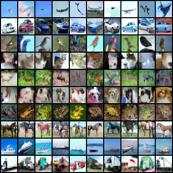
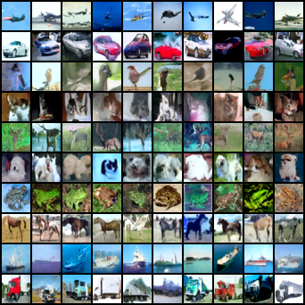
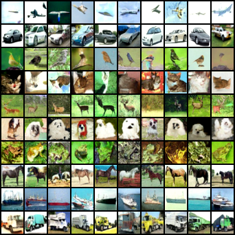
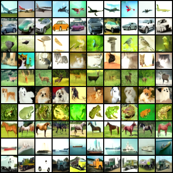

# Classifier-Free Diffusion Guidance

This implementation is adapted from [coderpiaobozhe/classifier-free-diffusion-guidance-Pytorch](https://github.com/coderpiaobozhe/classifier-free-diffusion-guidance-Pytorch)

```bash
.
├─logs
├─notes
│  └─pics
├─samples
│  └─MultiheadAttn
└─src
```

`logs`: Tensorboard log directory

`notes`: My notes about key formulas in CFG

`pt`: Saved-model directory

`samples`: some images sampled by the model with self-attention block

`samples/MultiheadAttn`: some images sampled by the model with multihead-attention block

`src`: source code directory

## How to Run

Ensure the current directory in your terminal is the root of the repository, and then `cd src`.

Datasets: CIFAR-10

Train: `python train.py [args]`

> usage: train.py [-h] [--batchsize BATCHSIZE] [--lr LR] [--epoch EPOCH] [--datadir DATADIR] [--modeldir MODELDIR] [--sampledir SAMPLEDIR] [--uncondrate UNCONDRATE] [--numgen NUMGEN] [--numlabel NUMLABEL] [--logdir LOGDIR] [--T T] [--betamode BETAMODE] [--w W] [--ddim DDIM] [--eta ETA] [--taumode TAUMODE] [--ddimsteps DDIMSTEPS] [--modelch MODELCH] [--chmul CHMUL] [--numres NUMRES] [--dropout DROPOUT]
>
> diffusion model training
>
> options:
>   -h, --help    show this help message and exit
>   --batchsize    batch size for training
>   --lr    learning rate
>   --epoch    epoch
>   --datadir    data directory
>   --modeldir    saved-model directory
>   --sampledir    sample directory
>   --uncondrate    rate of training without condition for classifier-free guidance
>   --numgen    the number of samples for each label
>   --numlabel    num of labels
>   --logdir    log directory
>   --T    total timesteps for diffusion
>   --betamode    noise schedule mode: cosine or linear
>   --w    hyperparameters for classifier-free guidance strength
>   --ddim    whether DDIM is used in sampling. If not, DDPM is used.
>   --eta    eta for variance during DDIM sampling process
>   --taumode    sub-sequence selection for reverse process in DDIM, which should be 'linear' or 'quadratic'
>   --ddimsteps    sampling steps for DDIM
>   --modelch    model channels for UNet
>   --chmul    architecture parameters training UNet
>   --numres    number of ResBlock+AttnBlock for each block in UNet
>   --dropout    dropout rate for ResBlock

Eval: `python eval.py [args]`

Specify your model path by joining `--modeldir` and `--modelfilename`

> usage: eval.py [-h] [--modeldir MODELDIR] --modelfilename MODELFILENAME [--sampledir SAMPLEDIR] [--numgen NUMGEN] [--numlabel NUMLABEL] [--T T] [--betamode BETAMODE] [--w W] [--ddim DDIM] [--eta ETA] [--taumode TAUMODE] [--ddimsteps DDIMSTEPS] [--modelch MODELCH] [--chmul CHMUL] [--numres NUMRES] [--dropout DROPOUT]
>
> diffusion model evaluation
>
> options:
>   -h, --help    show this help message and exit
>   --modeldir    saved-model directory
>   --modelfilename    saved-model filename
>   --sampledir    sample directory
>   --numgen    the number of samples for each label
>   --numlabel    num of labels
>   --T    total timesteps for diffusion
>   --betamode    noise schedule mode: cosine or linear
>   --w    hyperparameters for classifier-free guidance strength
>   --ddim    whether DDIM is used in sample, if not DDPM is used
>   --eta    eta for variance during DDIM sampling process
>   --taumode    sub-sequence selection for reverse process in DDIM, which should be 'linear' or 'quadratic'
>   --ddimsteps DDIMSTEPS    sampling steps for DDIM
>   --modelch    model channels for UNet
>   --chmul    architecture parameters training UNet
>   --numres    number of ResBlock+AttnBlock for each block in UNet
>   --dropout    dropout rate for ResBlock

## Some Results

**Using the model with self-attention block:**

- Using DDPM with `T=1000, betamode='linear', taumode='linear'`:

  

- Using DDIM with `T=50, betamode='linear', eta=0.5, taumode='linear'`:

  

**Using the model with self-attention block:**

- Using DDPM with `T=1000, betamode='linear', taumode='linear'`:

  

- Using DDIM with `T=50, betamode='linear', eta=0.5, taumode='linear'`:

  