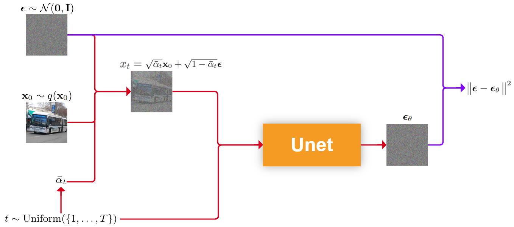
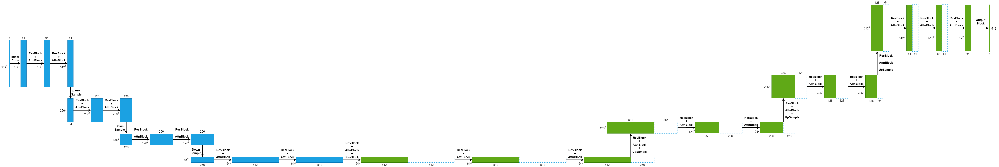

# Diffusion Model Notes

> 本文并非严谨的数学理论分析，仅作为本人实现[Classifier-Free Diffusion Guidance](https://github.com/Inblaze/DenoisingDiffusionProbabilisticModel)后的一次理论要点笔记。

## Preface

在扩散模型中，前向过程通过对原始图像逐步加噪得到符合多元高斯分布的样本图像，反向过程就是在多元高斯分布中采样出一个纯高斯噪声，然后对该噪声逐步去噪生成出一张符合真实图像概率分布的图像。换句话说，前向过程是数据集中的真实图像的概率分布转换到多元高斯分布的过程，反向过程就是多元高斯分布转换到数据集中真实图像的概率分布的过程。前向过程用于生成各时间步中的训练数据，然后用该数据训练神经网络，再用训练好的神经网络帮助完成反向过程的去噪。

## Forward Process

DDPM论文中，前向过程具有马尔可夫性质，整个过程是一个马尔科夫链，通过对原始图像$\boldsymbol{x}_{0}$逐步（t步）加上高斯噪声得到$\boldsymbol{x}_{t}$，逐步加噪公式：
$$
\boldsymbol{x}_{t} = \sqrt{1-\alpha_{t}} \boldsymbol{\epsilon}_{t} + \sqrt{\alpha_{t}} \boldsymbol{x}_{t-1}
$$
其中$\alpha_{t} = 1 - \beta_{t}$，而$\boldsymbol{\epsilon}_{t}$则是直接采样的高斯噪声。

逐步推导可以得到根据$\boldsymbol{x}_{0}$得到$\boldsymbol{x}_{t}$的公式（哇哦，和上面的公式竟然如此的对称）：
$$
x_{t} = \sqrt{1-\bar{\alpha}_{t}} \epsilon_{t} + \sqrt{\bar{\alpha}_{t}} x_{0}
$$
其中$\bar{\alpha}_{t}=\prod_{i=1}^{t} \alpha_{i}$

为什么要设计成这样呢？已知$\beta_{1}=10^{-4} \rightarrow \beta_{T}=0.02$，那么$\bar{\alpha}_{t}$是逐步接近于0的，只要$T$足够大，$\bar{\alpha}_{t}$最终将会接近于0，图像也就几乎成了纯高斯噪声，即图像最终均值接近于$\boldsymbol{0}$，方差接近于$\boldsymbol{I}$。

## Reverse Process

### 两种采样过程

#### Denoising Diffusion Probabilistic Model 

让我们从最基础的DDPM的反向过程说起。

反向过程是对噪声图像的逐步去噪，在最基础的DDPM中，去噪的公式如下：
$$
\boldsymbol{x}_{t-1} = \frac{1}{\sqrt{\alpha_{t}}}(\boldsymbol{x}_{t} - \frac{1-\alpha_{t}}{\sqrt{1-\bar{\alpha}_{t}}} \boldsymbol{\epsilon}_{\theta}(\boldsymbol{x}_{t}, t)) + \sigma_{t}\boldsymbol{z}
$$
其中
$$
\sigma_{t}^2 = \beta_{t}\quad or \quad \frac{\beta_{t}(1 - \bar{\alpha}_{t-1})}{1 - \bar{\alpha}_{t}}
$$
代码中的写法是
$$
\sigma_{t}^2 = 
\begin{cases}
\frac{\beta_{2}(1 - \bar{\alpha}_{1})}{1 - \bar{\alpha}_{2}} & t=1 \\
\beta_{t} & t>1
\end{cases}
$$

#### Denoising Diffusion Implicit Model

> 此处符号保持与DDPM一致，因此和DDIM论文中的公式略有不同。
>
> DDIM原论文中的$\alpha$为DDPM中的$\bar{\alpha}$

去噪公式：
$$
\boldsymbol{x}_{\tau_{i}-1} = 
\sqrt{\bar{\alpha}_{\tau_{i}-1}}(\underbrace{\frac{\boldsymbol{x}_{\tau_{i}} - \sqrt{1-\bar{\alpha}_{\tau_{i}}}\boldsymbol{\epsilon}_{\theta}(\boldsymbol{x}_{\tau_{i}},\tau_{i})}{\sqrt{\bar{\alpha}_{\tau_{i}}}}}_{predicted\ \boldsymbol{x}_{0}}) 
+ \underbrace{\sqrt{1-\bar{\alpha}_{\tau_{i}-1}-\sigma_{\tau_{i}}^2} \boldsymbol{\epsilon}_{\theta}(\boldsymbol{x}_{\tau_{i}},\tau_{i})}_{direction\ pointing\ to\ \boldsymbol{x}_{\tau_{i}}}
+ \sigma_{\tau_{i}}\boldsymbol{z}
$$
其中的$\{\tau_{i}\}$为DDIM加速后的时间步序列（根据加速后的总时间步对原来的时间序列进行线性选择或平方选择）

其中的标准差$\sigma_{\tau_{i}}$:
$$
\sigma_{\tau_{i}}=\eta \sqrt{\frac{1 - \bar{\alpha}_{\tau_{i}-1}}{1-\bar{\alpha}_{\tau_{i}}}(1-\frac{\bar{\alpha}_{\tau_{i}}}{\bar{\alpha}_{_{\tau_{i}-1}}})}
$$
其中$\eta$为hyperparameter，$\eta \in [0,1]$，当$\eta = 1$时DDIM退化成DDPM，当$\eta = 0$时去噪过程完全确定（即初步的纯高斯噪声确定，生成的图像就确定了）

### Conditional Diffusion Models

下面介绍的几种条件控制的Diffusion Model仅仅修改了Reverse Process，并没有修改Forward Process，更准确地说，仅仅修改了$\boldsymbol{\epsilon}$。

需要条件控制的时候，只需要用新的$\hat{\boldsymbol{\epsilon}}_{\theta}$替换掉原来无条件的DDIM或DDPM里的$\boldsymbol{\epsilon}_{\theta}$即可。训练的loss仍然是预测的$\boldsymbol{\epsilon}_{\theta}$和真实的$\boldsymbol{\epsilon}$的MSE

#### Classifier-Guidance

这个我还没代码实现，先介绍一下理论，有空再实现~

这个方法不需要重新训练U-Net，但需要额外训练一个分类器$p_{\phi}(y|\boldsymbol{x}_{t})$才能计算新的$\hat{\boldsymbol{\epsilon}}_{\theta}$，其中的$y$表示$\boldsymbol{x}_{t}$对应的类别:
$$
\hat{\boldsymbol{\epsilon}}_{\theta}(\boldsymbol{x}_{t},t,y) = \boldsymbol{\epsilon}_{\theta}(\boldsymbol{x}_{t},t,y) - \sqrt{1-\bar{\alpha}_{t}}g(\boldsymbol{x}_{t},t,y)
$$
其中$g$表示分类器梯度
$$
g(\boldsymbol{x}_{t},t,y) = \nabla_{\boldsymbol{x}_{t}}\log{p_{\phi}(y|\boldsymbol{x}_{t})}
$$

#### Classifier-Free

Classifier-Free需要重新训练——训练一个无条件的U-Net和一个带条件的U-Net.
$$
\hat{\boldsymbol{\epsilon}}_{\theta}(\boldsymbol{x}_{t},t,y) = (1+w)\boldsymbol{\epsilon}_{\theta}(\boldsymbol{x}_{t},t,y) - w \boldsymbol{\epsilon}_{\theta}(\boldsymbol{x}_{t},t)
$$
其中$\boldsymbol{\epsilon}_{\theta}(\boldsymbol{x}_{t},t,y)$为带条件U-Net预测的噪声，$\boldsymbol{\epsilon}_{\theta}(\boldsymbol{x}_{t},t)$为无条件U-Net预测的噪声。无条件U-Net和带条件U-Net可以同时训练，只需要在每次输入的训练数据中随机抽取一部分将他们的条件$y$置为0或None就行了。

$w$，即*Guidance Strength*，是一个非负的hyperparameter，$w=0$ refers to no-guided models，论文中在0.3处得到了最佳FID，在4.0处得到了最佳IS。

> 此处我不禁产生一个疑问：为什么要给带条件噪声和无条件噪声都乘上权重呢？众所周知Classifier-Free可以基于Classifier-Guidance推出，即将分类器梯度用贝叶斯公式展开，得到的结果直接代入会发现根本没有权重，新的噪声就等于$\boldsymbol{\epsilon}_{\theta}(\boldsymbol{x}_{t},t,y)$。那么我直接只训练一个带条件的U-Net预测噪声不就行了吗？为啥还要带无条件生成的噪声呢？

## U-Net

我的代码中的U-Net结构如下：

Condition Embedding和Timestep Embedding加在每个Residual Block中。
